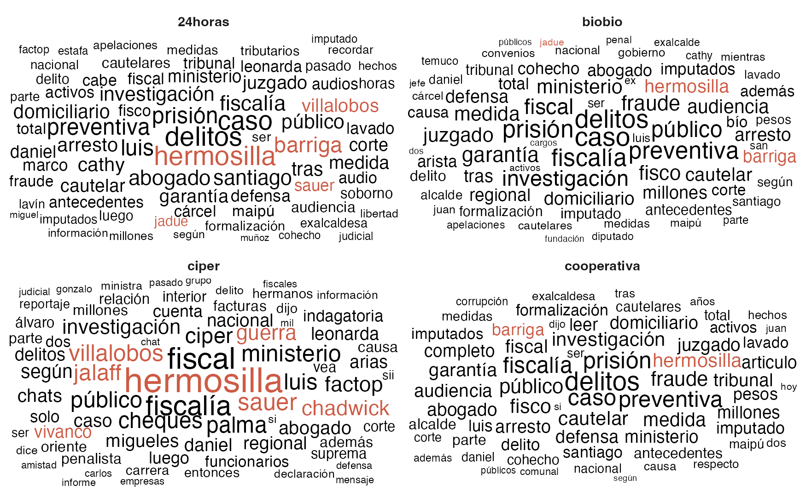

## Herramientas y Estrategias contra la Corrupción: _Talleres para la Medición y Análisis de la Corrupción en Chile desde el Análisis de Datos y Herramientas Abiertas_

_Congreso Estudiantil de Sociología Interdisciplinaria_

Miércoles 23 de julio, 2025.

----

Sesión 2: **Extracción de Datos desde Medios: Web scraping y Criterios de Selección/ Análisis y Visualización de Datos**

- Web scraping en investigación social: definición, casos de uso.
- Selección de medios y criterios éticos.
- Exploración de estructuras HTML simples (solo como contexto).
- Uso de la app de Bastián para extraer datos de prensa.
- Visualización básica en RStudio con ggplot2

## Aplicaciones
- [Visualizador de casos de corrupción en Chile](https://bastianoleah.shinyapps.io/corrupcion_chile/)
- [Visualizador de análisis de prensa digital en Chile](https://bastianoleah.shinyapps.io/prensa_chile/)

## Código
En este repositorio está todo el código usado en el taller.

- **Ejemplo de web scraping de un medio digital chileno:** `scraping.qmd`

- **Ejemplo de modelamiento de tópicos en análisis de texto:** `modelamiento_stm.R`

- **Análisis de datos de un corpus de noticias de corrupción (6.000 noticias):** `explorar.qmd`, los datos están disponibles en: `datos/prensa_corrupcion.parquet`

## Datos

- Base de datos de casos de corrupción en [formato Excel](https://github.com/bastianolea/corrupcion_chile/raw/main/datos/casos_corrupcion_chile.xlsx)
- Datos de prensa chilena: https://github.com/bastianolea/prensa_chile
- Datos obtenidos en ejemplo de web scraping: `datos/noticias.csv`
- Base de datos con noticias de corrupción (6.000 noticias), desde 2023 a julio de 2025: `datos/prensa_corrupcion.parquet`
- Base de datos con muestra de noticias chilenas (10.000, al azar) de toda temática del año 2024: `datos/prensa_datos_muestra.csv`

## Gráficos

----

